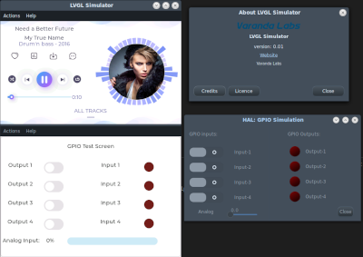

## LVGL Smulator based on GTK3



Easy to build and modify the privided skeleton [App](src/app/app-ui.c) for developing your own UI. 
- The following instructions work for Debian 11, Ubuntu/Mint 20.04 and up. Other Debian/Ubuntu base distros should also work.

- Windows and Mac: while easily portable to these platforms I to do not promote spywares.

### Install Dependencies:
```
sudo apt install build-essential cmake libgtk-3-dev glade git
```

### Checkout this repo and submodules:
```
git clone https://github.com/Varanda-Labs/gtk-lvgl-sim.git
cd gtk-lvgl-sim
git submodule update --init --recursive --progress
```

### To Build your custom App:
```
cd gtk-lvgl-sim
./clean.sh
./mk.sh

```
Subsequent rebuilds can skip the clean.sh command

### To Build your LVGL Music Demo:
```
cd gtk-lvgl-sim
./clean.sh
./mk_demo_music.sh

```
Subsequent rebuilds can skip the clean.sh command

### To run:
```
./run.sh
```

### To clean:
```
./clean.sh
```

### To debug (vscode or codium):
```
cd gtk-lvgl-sim
mkdir .vscode
cp launch.json .vscode/
./mk_debug.sh
```
- if using codium (free of MS spyware) use the first configuration
Native-Debug extension:  https://github.com/WebFreak001/code-debug 
- if using MS spyware use the second configuration
extension C/C++ from Microsoft

### License
MIT, read [LICENSE](LICENSE) file

